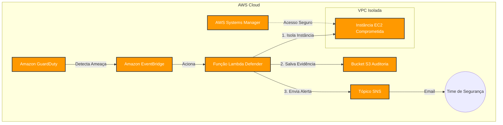

# CloudGuard – Plataforma de Detecção e Resposta a Incidentes em AWS


Infraestrutura de segurança provisionada com **Terraform**, pipeline DevSecOps via **GitHub Actions** e resposta automática a incidentes com **AWS Lambda + GuardDuty**.

---

## O que o projeto faz



| Capacidade | Serviço AWS | Módulo Terraform |
|---|---|---|
| Rede isolada sem exposição pública | VPC, Subnets, IGW | `modules/vpc` |
| Controle de acesso mínimo | IAM Roles, Instance Profile | `modules/iam` |
| Servidor hardened sem SSH | EC2, SSM, IMDSv2 | `modules/ec2` |
| Logs imutáveis e criptografados | S3, Versioning, SSE | `modules/s3` |
| Detecção de ameaças e auditoria | GuardDuty, CloudTrail, SNS | `modules/monitoring` |
| Contenção automática de instâncias | Lambda, EventBridge, SG | `modules/security-response` |

---

## Pré-requisitos

- Git e conta ativa no GitHub
- Terraform >= 1.6.0
- AWS CLI configurado (`aws configure`)
- Conta AWS com permissões de administrador
- Python 3.12+ *(para testar a Lambda localmente, opcional)*

---

## Estrutura de pastas

```plaintext
cloudguard-aws-security/
├── terraform/
│   ├── versions.tf                  # Versões do Terraform e providers
│   ├── providers.tf                 # Configuração do provider AWS + variáveis globais
│   ├── backend.tf                   # Backend remoto S3 + DynamoDB (referência)
│   ├── modules/
│   │   ├── vpc/                     # VPC, subnets públicas/privadas, IGW
│   │   ├── iam/                     # Roles para EC2, Lambda e CloudTrail
│   │   ├── ec2/                     # Instância hardened com SSM e IMDSv2
│   │   ├── s3/                      # Bucket de auditoria criptografado
│   │   ├── monitoring/              # GuardDuty, CloudTrail, SNS, alarmes
│   │   └── security-response/       # Lambda de isolamento + EventBridge
│   │       └── lambda/
│   │           └── handler.py       # Código Python da função de resposta
│   └── envs/
│       ├── dev/                     # Ambiente de desenvolvimento
│       └── prod/                    # Ambiente de produção
├── .github/
│   └── workflows/
│       └── terraform-ci.yml         # Pipeline CI/CD com validação e deploy
├── docs/
│   ├── threat-model.md              # Modelagem de ameaças (STRIDE)
│   ├── incident-scenarios.md        # Cenários e playbooks de resposta
│   └── decisions.md                 # ADRs – registro de decisões técnicas
└── diagrams/
    └── architecture.png             # Diagrama de arquitetura
```

---

## Configuração inicial (bootstrap)

Antes do primeiro `terraform apply`, crie manualmente o bucket S3 e a tabela DynamoDB para o state remoto:

```bash
# 1. Criar o bucket de state
aws s3api create-bucket \
  --bucket cloudguard-terraform-state \
  --region us-east-1

# 2. Habilitar versionamento no bucket
aws s3api put-bucket-versioning \
  --bucket cloudguard-terraform-state \
  --versioning-configuration Status=Enabled

# 3. Criar tabela DynamoDB para lock
aws dynamodb create-table \
  --table-name cloudguard-terraform-lock \
  --attribute-definitions AttributeName=LockID,AttributeType=S \
  --key-schema AttributeName=LockID,KeyType=HASH \
  --billing-mode PAY_PER_REQUEST \
  --region us-east-1
```

> **Nota sobre o GitHub Actions:** Para que o pipeline de CI/CD funcione, é necessário configurar previamente o Provedor de Identidade (OIDC) na sua conta AWS, permitindo que o GitHub assuma as roles de deploy sem o uso de chaves estáticas.

---

## Como fazer o deploy

> ⚠️ **Atenção:** Os comandos abaixo são recomendados apenas para testes locais. O deploy oficial da infraestrutura deve ser feito preferencialmente pela esteira de CI/CD via GitHub Actions.

### Ambiente DEV

```bash
cd terraform/envs/dev

# Inicializar (baixa providers e configura backend)
terraform init

# Visualizar o que será criado (sem aplicar)
terraform plan -var-file="terraform.tfvars"

# Aplicar a infraestrutura
terraform apply -var-file="terraform.tfvars"
```

### Ambiente PROD

```bash
cd terraform/envs/prod
terraform init
terraform plan -var-file="terraform.tfvars"
terraform apply -var-file="terraform.tfvars"
```

> O ambiente `prod` requer aprovação manual no GitHub antes do `apply` (configurado no workflow).

---

## Variáveis

Edite o arquivo `terraform.tfvars` do ambiente desejado:

| Variável | Descrição | Padrão |
|---|---|---|
| `aws_region` | Região AWS onde os recursos serão criados | `us-east-1` |
| `alert_email` | Email para receber alertas de segurança via SNS | `""` (desabilitado) |

---

## Como funciona o pipeline CI/CD

O arquivo `.github/workflows/terraform-ci.yml` executa as seguintes etapas automaticamente:

```plaintext
Push/PR em develop ou main
         │
         ▼
   [ validate ]          → terraform fmt + init + validate (dev e prod)
         │
    ┌────┴────┐
    ▼         ▼
[plan-dev] [plan-prod]   → terraform plan por ambiente
    │
    ▼
[apply-dev]              → apply automático ao fazer push em develop
    │
    ▼
[apply-prod]             → apply em main (requer aprovação manual no GitHub)
```

### Secrets necessários no GitHub

Configure em **Settings → Secrets and variables → Actions**:

| Secret | Descrição |
|---|---|
| `AWS_ROLE_ARN_DEV` | ARN da role IAM para deploy no DEV (via OIDC) |
| `AWS_ROLE_ARN_PROD` | ARN da role IAM para deploy no PROD (via OIDC) |
| `ALERT_EMAIL` | Email para alertas de segurança |

> O pipeline usa OIDC para autenticar na AWS — sem access keys hardcoded. [Veja como configurar: GitHub OIDC + AWS](https://docs.github.com/en/actions/security-for-github-actions/security-hardening-your-deployments/configuring-openid-connect-in-amazon-web-services)

---

## Como a resposta a incidentes funciona

1. **GuardDuty** detecta uma ameaça (ex: instância minerando criptomoeda, backdoor ativo).
2. **EventBridge** captura o finding com severidade >= 7.
3. **Lambda** (`handler.py`) executa automaticamente:
   - Troca o Security Group da instância comprometida pelo SG de isolamento (sem tráfego).
   - Salva o finding completo no S3 como evidência forense.
   - Envia notificação via SNS com detalhes do incidente.
4. O time de segurança recebe o alerta e dá continuidade à investigação manual.

---

## Segurança aplicada

- **EC2 sem SSH e sem IP público** – acesso somente via AWS SSM Session Manager.
- **IMDSv2 obrigatório** – previne ataques SSRF que roubam credenciais da instância.
- **IAM com menor privilégio** – cada recurso tem apenas as permissões que usa.
- **S3 com Block Public Access** – nenhum dado de auditoria exposto publicamente.
- **Criptografia em repouso** – volumes EC2 e objetos S3 criptografados com AES-256.
- **CloudTrail multi-região** – todas as chamadas de API registradas e validadas.

---

## Destruir a infraestrutura

```bash
cd terraform/envs/dev
terraform destroy -var-file="terraform.tfvars"
```

> O bucket S3 de auditoria tem `force_destroy = true` apenas no DEV. No PROD ele não será destruído automaticamente para preservar logs e evidências.

---

## Próximos passos sugeridos

- [ ] Adicionar `tfsec` ou `checkov` ao pipeline para análise estática de segurança.
- [ ] Configurar AWS Organizations + SCPs para restringir ações em nível de conta.
- [ ] Implementar AWS Security Hub para centralizar findings.
- [ ] Adicionar notificação no Slack via Lambda ou SNS subscription HTTP.
- [ ] Preencher os documentos em `/docs` com o threat model e os playbooks do seu contexto.

---

## Autor

Criado e mantido por **Johnata**

